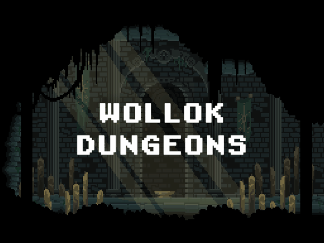
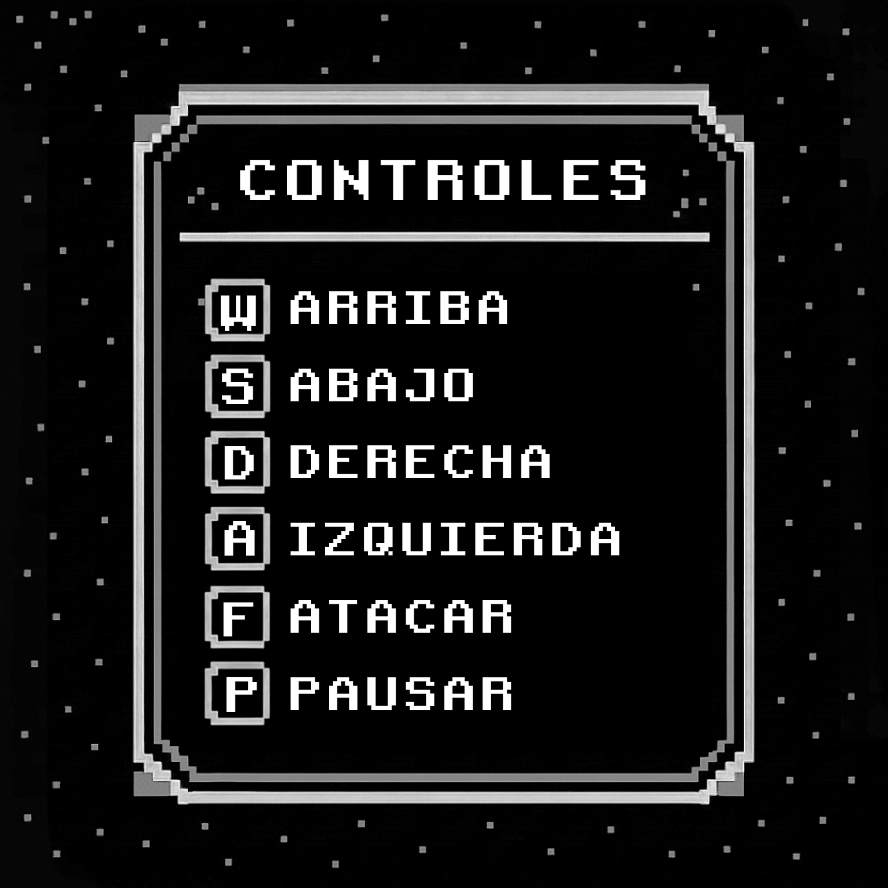
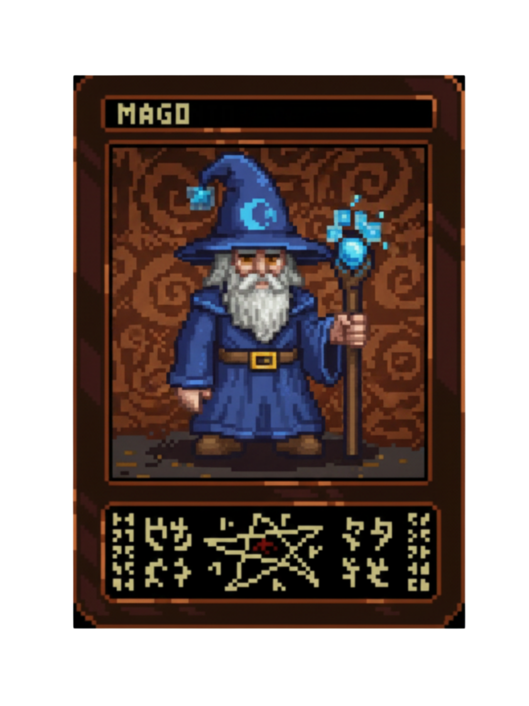
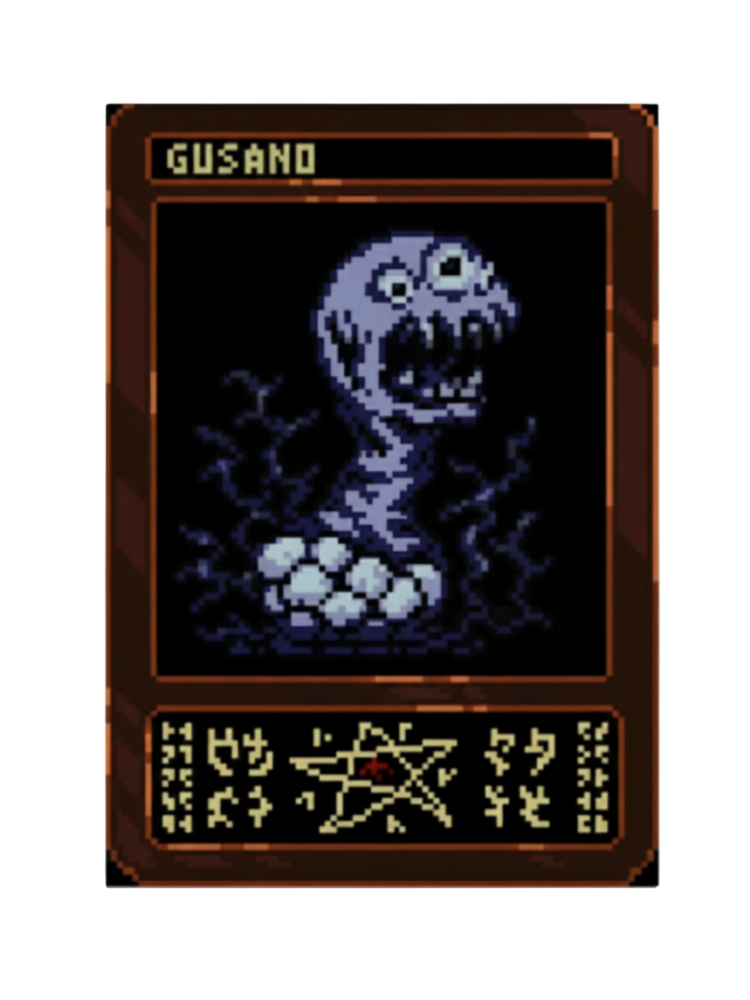
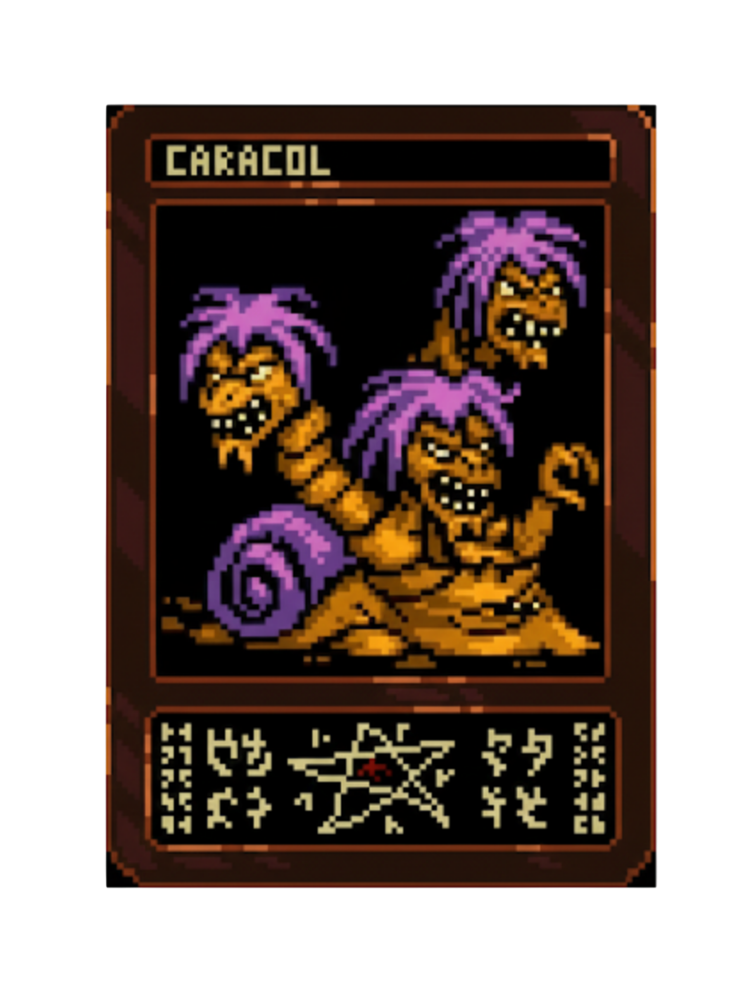
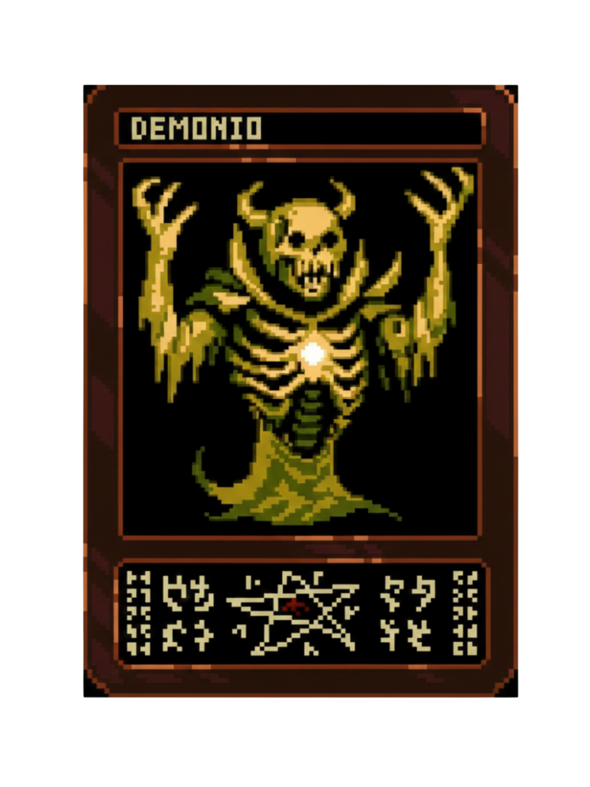
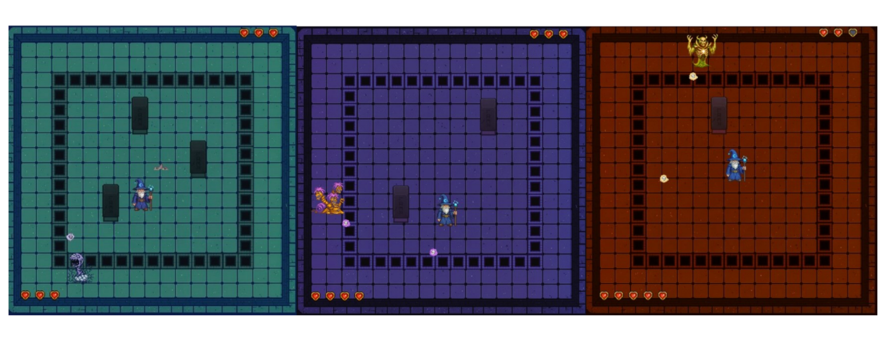

<section align = "center", id = "Presentacion">
    
</section>

<section align = "center", id = "juego">
    <h1 align = "center"> ♱ Sobre el juego ♱ </h1> 
    

        Una vez iniciado el juego, tomas el control de tu personaje predeterminado 
        "El Mago". Tu misión es abrirte paso a través de la mazmorra derrotando a los 
        tres guardianes que bloquean tu camino. La dificultad es progresiva: cada 
        enemigo es más fuerte que el anterior, exigiendo que domines tus hechizos.

</section>  

<section align = "center", id = "controles">
    <h1 align = "center"> Controles </h1> 
      
</section>    

<section align = "center", id = "Personajes">
    <h1 align = "center"> ♱ Personajes del juego ♱ </h1>
    <h2 align = "center"> Mago </h2>
    
    

        Un anciano y sabio hechicero de larga barba blanca. 
        Cuenta con ataques y movimientos rápidos, tiene tres vidas.

 
      
    <h2 align = "center"> Gusano putrefacto </h2>
    
    

        El gusano emerge de un nido de huevos con una expresión 
        maníaca, luciendo dos ojos saltones y desorbitados. 
        Cuenta con ataques y movimientos lentos, tiene tres vidas.

 
      
    <h2 align = "center" Caracol de tres cabezas> </h2>
    
    

        El caracol es una monstruosa criatura híbrida, 
        mitad caracol y mitad bestia. Cuenta con ataques 
        y movimientos rápidos, tiene cuatro vidas.

 
      
    <h2 align = "center"> Demonio </h2>
    
    

        El demonio es una aterradora entidad esquelética 
        de tono amarillento. Cuenta con ataques
        y movimientos muy rápidos, tiene cinco vidas.

</section> 

<section align = "center", id = "niveles">
    <h1 align = "center"> Niveles </h1> 
    
</section>

<section align = "center", id = "equipo">
    <h1 align = "center"> ♱ Equipo — 6bits ♱ </h1> 
    

    • Sebastián Tomasín
    • Elisa Laginestra
    • Federico Silva
    • Ezequiel Perezlindo
    • Tomas Ferrero
    • Hirsch Alan

</section>

<section align = "center", id="datos">
    <h1 align = "center"> Datos </h1> 
    

    • Versión: 1.0.2
    • Repositorio público
    • Universidad Nacional de Hurlingham

</section>

