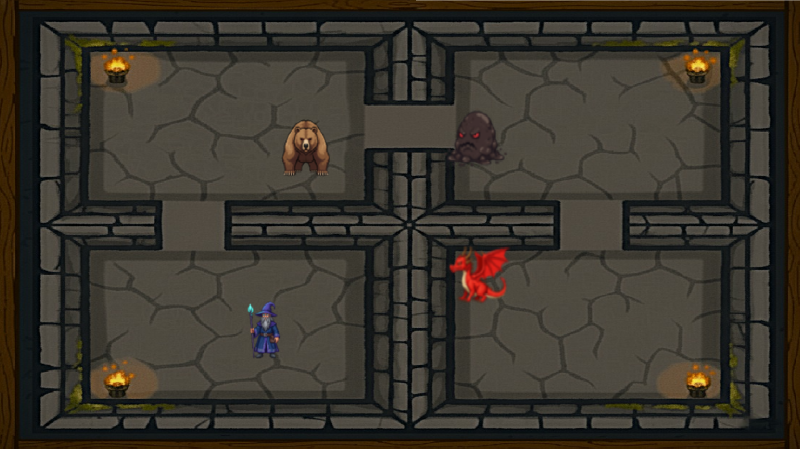

# Wollok Dungeons

## Reglas del juego / instrucciones
Una vez iniciado el juego, empieza con tu personaje predeterminado "el mago", donde solo puede atacar al enemigo del turno correspondiente y curarse. 

Tiene 4 enemigos a derrotar: Avispa, Oso, Slime y Dragón. La dificultad va escalando a medida que se van superando las salas. La finalidad es lograr matar al dragón.

## Equipo
- Sebastián Tomasín
- Ezequiel Perezlindo
- Federico Silva
- Elisa Laginestra
- Tomas Ferrero
- Hirsch Alan

## Otros
Programación con Objetos I — UNAHUR

Versión de Wollok: 1.0.2

Privado